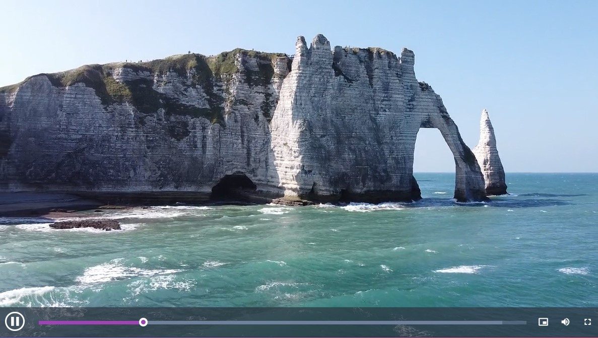

# Vite Videoplayers

This project is bootstraped with Vite + React. I used the Vite build tool for its fast development experience instead of CRA.

## Prerequisites

- NodeJs >= 16.0.0

## For local testing and development

Install dependencies with `npm install`

Run the dev server with `npm run dev`

## Demo

[Live Demo](vite-videoplayer.netlify.app) on netlify.

